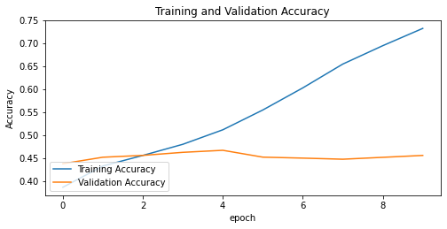

#  Image classification using CNN for Diabetic Retinopathy

## Background

Diabetic Retinopathy is disease of the eyes 

 - caused by high blood sugar
    
 - Affects blood vessels
    
 - Causes Loss of Vision
   
 - Measured by Disease Proliferation

Affects individuals with diabetes

Found in 4.1 million people

 - Roughly 1/29 diabetics
   
 - 1/3 are African-American and Mexican-American

## Business Problem

We are building a deep learning model to detect the various levels of diabetic retinopathy

Applications of CNN include

 - Image Detection
 
 - Image Analysis
 
 - Object Detection 

  Why?
  
Medical misdiagnosis caused by varying legels of knowledge and experience

Ensuring proper diagnosis for medical professional

For Who: You our Investor!

## Data

Data is created by TensorFlow

Contains images of 35,000+ images of different levels of Diabetic Retinopathy

## Methods

Images imported from directory

Baseline model created for comparison

Model evalution

Using Tranfer Learning, instantiating pre-trained model as base. Transfer Learning is using pre-trained model. 

Adding the base model to final model

Model Evaluation

## Results

Data Visualization for initial model accuracy

Data Visualization for initial model loss

- Overtime we see overfitting occurring at epoch 6-7. Over fitting is simply, overreliance on training data
    
- Validation loss/accuracy stable. 

- Training Accuracy & Loss improves over time

Data Visualization of model with transfer learning performance accuracy

Data Visualization of model with transfer learning performance loss

- Overtime we see overfitting occurring at epoch 6-7. 

- Validation loss/accuracy stable. 

- Training Accuracy & Loss improves over time

Confusion Matrix of Main Model

Confusion Matrix of Transfer Learning Model

Unfortunately, the models can not distinguish between the different classes. Even after applying transfer learning. Additional images and feature engineering are  needed.

## Conclusions / Summary of Findings

The model evaluation shows 68% Accuracy

Overfitting occus in both models

Transfer learning greatly improves model performance

Unfortunately, requires the data requires additional images (such as from different angles, clear images, etc.),

Results limited to computational resources available

Model could not distinguish between different classes.

## Next Steps...

1) Build Deep Learning models to other ocular diseases (e.g., Diabetic Macular Edema)

2) Pursue other areas of medicine, where we can track disease progression. (e.g., Cancer metastasis)

3) Use Deep learning to build models for disease detection (e.g., Pneumonia)

### Overview of Github structure
├── dataset : data used for modeling

├── images : images used in PPT and readme

├── README.md : project information and repository structure

├── dsc-phase-5-project-presentation.pptx : (Presentation for Stakeholders)

└── Diabetic Retinopathy Image Classification.ipynb (jupyter notebook used for modeling)

